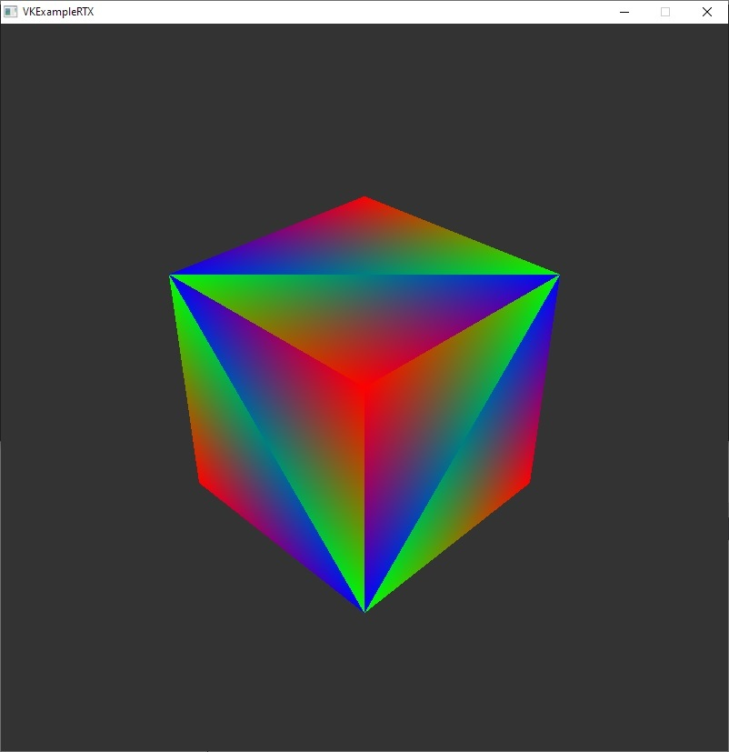

# VKExampleRTX

The application demonstrates a simple example of ray tracing. It does not calculate shadows or reflection, but rather contains a minimal example needed to run the ray tracing pipeline. The code is written to demonstrate an exact sequence of actions you have to perform in order to run a ray tracing application using Vulkan, so no homemade frameworks, just a single big main function. Some code duplication was intentionally left to make the sequence simple.



### x64 only!
Ray tracing extensions are not supported by x86 version of nvidia dlls, so you have to compile the example for x64.

### Build tools
* CMake version 3.17.1
* MinGW version 7.3.0

### Dependencies
- GLFW v3.3.2 (https://www.glfw.org/)
- GLM v0.9.9.8 (https://glm.g-truc.net/0.9.9/index.html)
- LunarG Vulkan SDK v1.2.141.0 (https://www.lunarg.com/vulkan-sdk/)

### Build instruction
- Note that ray tracing is available only for x64
- Download prebuilt binaries of dependencies and unpack them
- Prepare the following CMake variables:
  - **GLFW_INC** - path to GLFW include directory
  - **GLFW_LIB** - path to GLFW lib directory
  - **GLM_INC** - path to GLM include directory
  - **VK_SDK** - path to LunarG Vulkan SDK directory
- Clone repo and build it using cmake & make
  ```bash
  git clone https://github.com/artyom-256/VKExampleRTX.git
  cd VKExampleRTX
  mkdir build
  cd build
  cmake .. -DGLFW_INC=C:/Lib/glfw-3.3.2/include \
           -DGLFW_LIB=C:/Lib/glfw-3.3.2/lib \
           -DGLM_INC=C:/Lib/glm-0.9.9.8/include \
           -DVK_SDK=C:/Lib/VulkanSDK_1.2.141.0
  make -j4
  ``` 

### Using validation layers
If you want to enable debug messages, compile the project with -DDEBUG_MODE.
In order to run the application you have to enable validation layers according to https://vulkan.lunarg.com/doc/view/1.1.121.1/linux/layer_configuration.html
For example for Windows you should set the following environment variables:
  ```bash
  set VK_LAYER_PATH=C:\Lib\VulkanSDK_1.2.141.0\Bin
  set VK_INSTANCE_LAYERS=VK_LAYER_KHRONOS_validation
  ```

### Note
- Mentioned versions of GCC and libraries are not strict requirements. This is what I used to compile the application. If other versions work for you - feel free to use them.

### Contacts
- Artem Hlumov <artyom.altair@gmail.com>
